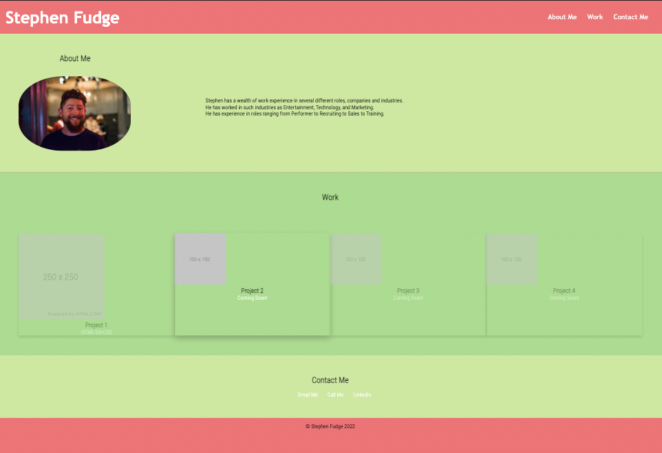

# shiny-sniffle

## Personal Portfolio - Challenge Assignment 2 Advanced CSS

- *What was your motivation?*  I wanted to build a website to attach to a resume with an idea of what I am capable of creating.
-*Why did you build this project?*  To show people projects that I have been involved in creating.
- *What problem does it solve?*  It solves the problem of trying to explain what I've created and how I did it, instead of trying to explain it all, I can show them.
- *What did I learn?* I learned how to have the page adjust based on the screen size using media queries and still look good. I learned how to create root variables for things that repeat such as a colour. I learned about using flexbox and the many capabilities of it. 

## Installation

*What are the steps required to install your project? Provide a step-by-step description of how to get the development environment running.*

Go to https://stephenfudge.github.io/shiny-sniffle/  and the page should load and function properly. 

Alternatively, if you wish to download the files then you shoud do the following:
Download the index.html file as well as the assets folder and the project should work and function properly. 

## Usage

*Provide instructions and examples for use. Include screenshots as needed.*

To use the website, you can click on any of the three links across the top and it will take you to the corresponding section. In the "Work" section the link for Project 1 will open the first assignment in the course in a new tab.  In the "Contact" section, if you click on 'Email Me' it should open an email addressed to me in your preferred email client. If you click on 'Call Me' it should call me and the 'LinkedIn' link should take you to my LinkedIn Profile.

Below is a screenshot of what the website should look like.

## Credits

I used w3schools.com to assist with the CSS for the links inside the header to put them in a line and MDN for the cards that I used for the projects. I used favicon for the browser icon, and https://placeholder.com/ for the placeholder images.
